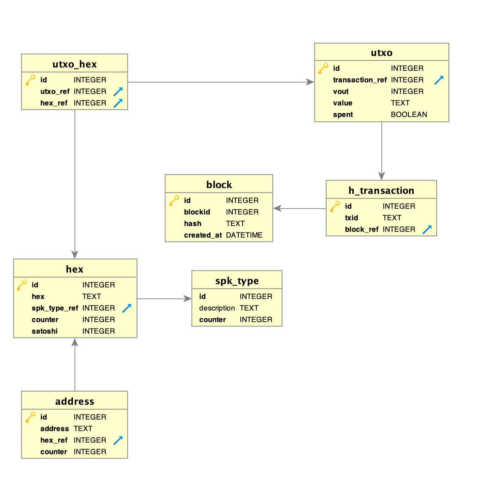

# Minimal Bitcoin Explorer

This is a node.js project building a `sqlite` database with the amounts related to a generic Bitcoin Address.
The stage is to be considered experimental, and collected data still need validation.

Soon a version running on `mongodb`.

* [Installation](#installation)
* [Configuration](#configuration)
* [Run](#run)
* [Sniffing](#sniffing)
* [DB-Schema](#db-schema)

## Installation
```
$ npm install
$ sqlite3 explore.sqlite < sql/explore_createdb.sql
$ sqlite3 explore.sqlite < sql/vv_utxo_address_hex.sql
$ sqlite3 explore.sqlite < sql/vv_utxo_hex.sql
```
the following `npm` dependencies will be installed:
* better-sqlite3
* bitcoin-core
* xo

## Configuration
```
$ cp configuration-template.js configuration.js
```

Edit `configuration.js` setting the right `port` (`rpcport` in `bitcoin.conf`), `username` and `password`

## Run
```
$ node explore-sqlite.js
```
The application build the database throw bitcoind's RPC-APIs:
* ~~`getblockhash`~~
* `getblock`

## Sniffing

To see the progress, you can sniff the network, to catch the block it is archiving.

Check your `LOOPBACK` network interface.

For example on macOS with `ifconfig -a` and on CentOS with `ip link show` and modify the `-i` parameter in [sniff_getblockhash.sh](sniff_getblockhash.sh) according to your `LOOPBACK` network interface.

```
$ . sniff_getblock.sh
[sudo] password for satoshi:
tcpdump: verbose output suppressed, use -v or -vv for full protocol decode
listening on lo, link-type EN10MB (Ethernet), capture size 262144 bytes
{"id":"1548778824122","method":"getblock","params":["000000002d64d1be2e1eded8d1732ae531c7d2d9ec537aec734a0d49617d28a9",2]}
{"id":"1548778824127","method":"getblock","params":["00000000ceb841a7ab31fec1932094e0e9eda3e5f2935d90fe4135d70715e86b",2]}
{"id":"1548778824130","method":"getblock","params":["000000001ca762d8675fd3aa4e374dff035174331efe12721079ba408793082b",2]}
{"id":"1548778824133","method":"getblock","params":["000000008524243a64e287382c97c1aba472565d2c722b5c2fe011d055ee197d",2]}
{"id":"1548778824136","method":"getblock","params":["000000002387d7751b3ed66563d541f86d5a1205681fedbf9c209eefa2329d06",2]}
{"id":"1548778824139","method":"getblock","params":["00000000059ba4df42a5fe5aef70066b50612d15feaa5997fc0e6069f61d7844",2]}
{"id":"1548778824142","method":"getblock","params":["000000006f475ce1caff24080aec6adea6e531ba197b8858370c80c0598d95ef",2]}
```

## DB-Schema
`

